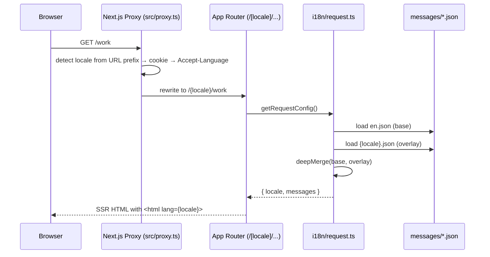

# Architecture

This document describes the high-level architecture of **ayushyadav.dev** — a personal portfolio
built on Next.js 14 (App Router) with server-side rendering, edge-runtime API routes, and a
component-driven UI.

## Stack

| Layer         | Choice                                            |
| ------------- | ------------------------------------------------- |
| Framework     | Next.js 14 (App Router, RSC)                      |
| Language      | TypeScript 5 (strict, `noUncheckedIndexedAccess`) |
| Styling       | Tailwind CSS 3, CSS variables for tokens          |
| UI primitives | Radix UI, `lucide-react` icons                    |
| Animations    | framer-motion (with `prefers-reduced-motion`)     |
| Forms         | Native + zod schema validation                    |
| Email         | Resend (server route)                             |
| Image         | Next.js `<Image>` + `sharp`                       |
| E2E tests     | Playwright                                        |
| Unit tests    | Vitest + Testing Library                          |
| Lint / format | ESLint (next/core-web-vitals), Prettier           |
| Deployment    | Vercel (recommended) or any Node host             |

## Directory layout

```
src/
  app/                Next.js App Router (routes, layouts, API)
    api/contact/      Edge route — validates + sends email via Resend
    (pages)/          page.tsx files (about, work, contact, …)
  components/         Reusable UI: hero, projects, contact, layout, …
  content/            Static content (projects, experience, skills, profile)
  lib/                Pure server / shared logic
    validation.ts     zod schemas
    email.ts          Email subject/body builders
    rate-limit.ts     In-memory IP rate limiting
    feeds.ts          RSS/Atom helpers
    github.ts         GitHub API helpers
    utils.ts          Misc helpers (cn, formatters)
public/               Static assets (images, certificates, favicons)
tests/                Playwright e2e specs
src/**/__tests__/     Vitest unit tests (co-located)
docs/                 Project documentation (this folder)
```

## Rendering strategy

- **Static (SSG)** for content pages across all 6 locales: `/`, `/about`, `/work`,
  `/work/[slug]`, `/skills`, `/experience`, `/competitive-programming`, `/contact`,
  `/feeds`, `/lab` — each pre-rendered per locale (`/`, `/hi`, `/ja`, `/sa`, `/zh`, `/ru`).
- **Dynamic (edge)** for `/api/contact` and `/opengraph-image` only.
- **Incremental revalidation**: `export const revalidate = 3600` on the home page.

## Internationalization



Key files:

- `src/i18n/routing.ts` — locale list, default, `localePrefix: "as-needed"`, detection.
- `src/i18n/navigation.ts` — locale-aware `Link`, `useRouter`, `usePathname`.
- `src/i18n/request.ts` — message loader with deep-merge English fallback.
- `src/proxy.ts` — next-intl middleware (renamed to `proxy` per Next 16).
- `messages/{en,hi,ja,sa,zh,ru}.json` — translated UI strings; `en.json` is the source of truth.
- `src/components/layout/language-switcher.tsx` — globe icon dropdown in header.

See [ADR-0004](./ADR/0004-i18n-next-intl.md) for the rationale.

## Performance principles

1. Server components by default; `"use client"` only where interactivity is needed.
2. `next/image` everywhere — never raw `` — with `sizes` set.
3. Animations gated by `useReducedMotion()` **and** an `IntersectionObserver` pause when scrolled
   off-screen (see `src/components/hero/hero-visualization.tsx` and `src/components/layout/in-view.tsx`).
4. `content-visibility: auto` on long lazy sections (`.lazy-section`).
5. GPU-composited marquee with `will-change: transform`, `translateZ(0)`.
6. No client-side data fetching on first paint.

## Security

- HTTP security headers configured in `next.config.mjs` (`X-Frame-Options`, `X-Content-Type-Options`,
  `Referrer-Policy`, `Permissions-Policy`).
- Contact API protected by:
  - Honeypot field (`website`).
  - zod schema validation.
  - In-memory IP rate limit (`src/lib/rate-limit.ts`).
- No `dangerouslySetInnerHTML`.
- Secrets in `.env.local` (never committed). See `.env.example`.

## Deployment

- `npm run build` → `.next/`
- `npm start` → production server on port 3000.
- Recommended host: Vercel (auto image optimization, edge functions).
