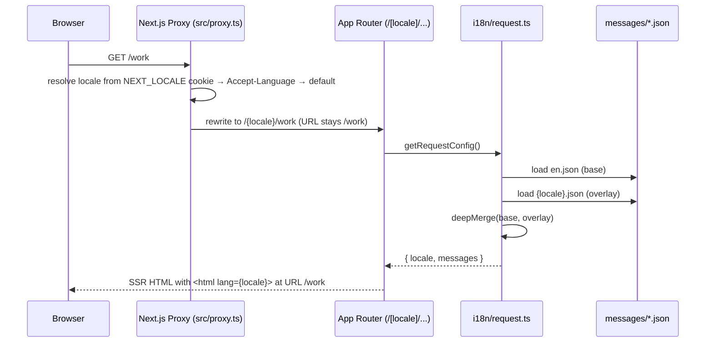

# Architecture

This document describes the high-level architecture of **ayushyadav.dev** — a personal portfolio
built on Next.js 16 (App Router) with server-side rendering, Node-runtime API routes, and a
component-driven UI.

## Stack

| Layer         | Choice                                            |
| ------------- | ------------------------------------------------- |
| Framework     | Next.js 16 (App Router, RSC)                      |
| Language      | TypeScript 6 (strict, `noUncheckedIndexedAccess`) |
| Styling       | Tailwind CSS 4, CSS variables for tokens          |
| UI primitives | Radix UI, `lucide-react` icons                    |
| Animations    | framer-motion (with `prefers-reduced-motion`)     |
| Forms         | Native + Zod 4 schema validation                  |
| Email         | Resend (Node-runtime route)                       |
| i18n          | next-intl 4, `localePrefix: "never"`              |
| Image         | Next.js `<Image>` + `sharp`                       |
| E2E tests     | Playwright + `@axe-core/playwright`               |
| Unit tests    | Vitest + Testing Library                          |
| Lint / format | ESLint 10 (flat config), Prettier                 |
| Deployment    | Vercel (recommended) or any Node host             |

## Directory layout

```text
src/
  app/                Next.js App Router (routes, layouts, API, icons)
    icon.jpg          Phoenix favicon (auto-served at /icon.jpg)
    apple-icon.jpg    Apple touch icon
    api/contact/      Node-runtime route — validates + sends email via Resend
    [locale]/         Locale-aware routes (page.tsx files for each section)
    opengraph-image.tsx  Edge-runtime OG image generator
    sitemap.ts           SEO sitemap
    robots.txt/ , humans.txt/  Route handlers (content-negotiated text/HTML)
  components/         Reusable UI: hero, projects, contact, layout, …
  content/            Static content (projects, experience, skills, profile)
  i18n/               Locale routing, navigation, request config (next-intl)
  lib/                Pure server / shared logic
    validation.ts     Zod schemas (codes mapped to translations on the client)
    email.ts          Email subject/body builders
    rate-limit.ts     In-memory IP rate limiting
    feeds.ts          RSS/Atom helpers
    github.ts         GitHub API helpers
    greeting.ts       Local time-of-day bucket for the header greeting chip
    utils.ts          Misc helpers (cn, formatters)
  proxy.ts            next-intl middleware (Next 16 renamed `middleware → proxy`)
public/               Static assets (images, certificates, favicons)
messages/             Per-locale UI strings (en.json is the source of truth)
tests/                Playwright e2e specs
src/**/__tests__/     Vitest unit tests (co-located)
docs/                 Project documentation (this folder)
```

## Rendering strategy

- **Static (SSG)** for content pages whenever locale detection allows pre-rendering. Each
  page calls `setRequestLocale(locale)` so next-intl knows which messages to bake in.
- **Dynamic** (Node runtime) for `/api/contact`.
- **Edge** for `/opengraph-image` only.
- **Incremental revalidation**: `export const revalidate = 3600` on content pages.

## Internationalization



The crucial property is `localePrefix: "never"` — the URL is identical across every locale
(`/about` always means "the about page"). The active locale is resolved entirely server-side
from the `NEXT_LOCALE` cookie (set by the language switcher) and `Accept-Language` header.

Key files:

- `src/i18n/routing.ts` — locale list, default, `localePrefix: "never"`, detection enabled.
- `src/i18n/navigation.ts` — locale-aware `Link`, `useRouter`, `usePathname`, `redirect`.
- `src/i18n/request.ts` — message loader with deep-merge English fallback.
- `src/proxy.ts` — next-intl proxy (renamed from middleware in Next 16).
- `messages/{en,hi,ja,sa,zh,ru}.json` — translated UI strings; `en.json` is the source of truth.
- `src/components/layout/language-switcher.tsx` — globe icon dropdown; calls
  `router.replace(pathname, { locale })` + `router.refresh()` to swap content in place.

See [ADR-0004](./ADR/0004-i18n-next-intl.md) for the rationale.

## Client-local greeting

The header includes a small cloud-icon greeting chip beside the brand name. It computes only a
coarse time-of-day bucket (`morning`, `afternoon`, `evening`, `night`) from the visitor's browser
clock, then renders a translated welcome/explore message from `messages/*.json`.

The time-of-day greeting is client-only: it does not use IP geolocation, does not send timezone data
to the server, does not display the visitor's clock, and does not create cookies. It auto-opens on
visit and remains manually accessible from the header.

See [ADR-0005](./ADR/0005-client-local-greeting.md) for the rationale.
See [ADR-0007](./ADR/0007-remove-weather-greeting.md) for the weather/geolocation removal decision.

## Performance principles

1. Server components by default; `"use client"` only where interactivity is needed.
2. `next/image` everywhere — never raw `` — with `sizes` set. The one exception is
   `src/components/experience/company-logo.tsx`, which falls back across three logo sources
   (local SVG → Clearbit → Google s2) and needs the bare `` to handle `onerror`.
3. Animations gated by `useReducedMotion()` **and** an `IntersectionObserver` pause when scrolled
   off-screen (see `src/components/hero/hero-visualization.tsx` and `src/components/layout/in-view.tsx`).
4. `content-visibility: auto` on long lazy sections (`.lazy-section`).
5. GPU-composited marquee with `will-change: transform`, `translateZ(0)`.
6. No client-side data fetching on first paint.

## Security

- HTTP security headers configured in `next.config.mjs` — `Content-Security-Policy`,
  `Strict-Transport-Security` (2-year preload), `X-Frame-Options`, `X-Content-Type-Options`,
  `Referrer-Policy`, `Permissions-Policy`, `Cross-Origin-Opener-Policy`,
  `Cross-Origin-Resource-Policy`.
- Contact API protected by:
  - Honeypot field (`website`).
  - Zod schema validation (error codes mapped to localized strings on the client).
  - In-memory IP rate limit (`src/lib/rate-limit.ts`).
- Person JSON-LD is the only `dangerouslySetInnerHTML` usage; everything else is React-rendered.
- Secrets in `.env.local` (never committed). See `.env.example`.

## Deployment

- `npm run build` → `.next/`
- `npm start` → production server on port 3000.
- Recommended host: Vercel (auto image optimization, edge functions).
