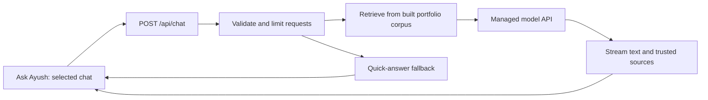

# Portfolio update notes and Ask Ayush server plan

Updated: October 1, 2026.

> **Follow-ups (2026-10-09):** Product deltas + original-plan review live in
> [`docs/plans/portfolio_followup_2026-10.md`](./plans/portfolio_followup_2026-10.md).
> Server/API Ask Ayush is formalized as proposed
> [`docs/ADR/0014-server-backed-ask-ayush-inference.md`](./ADR/0014-server-backed-ask-ayush-inference.md)
> (this file’s “Server/API migration plan” section remains the longer sketch).

## What changed

- **Ask Ayush** replaces the assistant’s public name. Its settings open from either
  the chatbot gear or Site settings → Ask Ayush settings. Both open the same panel
  and use the same preferences and model runtime.
- **Remove downloaded models** stops local AI, deletes this origin’s WebLLM model,
  WASM and config caches and wllama’s model cache, and saves quick-answer mode.
  Both engines are attempted even if one deletion fails. A partial failure is
  reported with a retry suggestion. This does not erase conversations.
- **New chat** creates an independent conversation. Choose a chat to switch;
  **Clear context** retains the visible transcript but excludes earlier messages
  from retrieval follow-ups and AI prompts. **Clear chat** erases that chat and its
  context. **Delete chat** removes the selected conversation when another exists.
- Chat controls are disabled during an answer; use **Stop** first. Chats live in
  this tab’s `sessionStorage`, under `phoenix:chat:sessions`, with a limit of 20 chats
  and 100 messages per chat. Closing the panel or refreshing preserves them.
  Browser session restoration may retain them; use the explicit clear/delete
  controls when you want removal. Blocked/full storage falls back to memory.
- The current résumé is available through `SITE.resumePath` at
  `/assets/resume/Ayush_Yadav_Resume_2026-10.pdf`. Its SHA-256 matches the supplied
  `C:\Users\aayus\Desktop\Ayush_Yadav_Resume.pdf`:
  `FF5F06403DFC8E69524BE4C1606BA69C0AD6463FB5CB26000D42E170E479D24E`.
  The versioned URL bypasses browsers holding the old immutable asset. The legacy
  `public/assets/resume/Resume.pdf` also contains the replacement.
- The hero, introduction, principles, engineering outcomes and recognition use the
  owner-supplied facts, recorded in `src/content/*.ts`. Cadence has separate
  January 2026–present and July 2022–January 2026 roles. Durations are represented
  by dates rather than a hard-coded month count that goes stale.
- Work now contains four project cards initially, expandable to all matching
  projects, followed by four expandable system-design cards and Public Workbench.
  The home page previews two designs. Search lists four projects and four designs.
- Each `/system-design/[slug]` page has an architecture demo, HLD, LLD and
  trade-offs/failure notes. These are built portfolio reference demos, including
  step-through pipelines; they do not claim production deployments of all six
  systems. Heavy demos still load lazily.
- Skills uses separate **Technical categories** and **Applied engineering** filter
  groups. Applied groups show tools and links to the projects where they are used,
  without the previous Engineering Spectrum write-ups.
- **Practice & Plans** combines competitive programming, current focus and the
  roadmap. Initial targets: InfraLens Q1 2027, TraceMind Q2 2027, SiliconGraph
  Q3 2027; Q4 is for integration, documentation and feedback. These are planning
  targets. The page explains the learn → small working slice → validate approach.
- Now and System Design are removed from the footer, and Now is removed from the
  header navigation. Existing `/now` links remain usable. Engineer Mode starts off
  on full loads and is enabled through Site settings or the existing `n` shortcut.
- Revised long-form copy uses the existing English fallback in other locales;
  new navigation and core chat controls have localized labels. Existing unrelated
  translations are preserved. No locale URL prefixes or new cookies were added.

## Voice introduction: where to put the recording

Save an actual MP3 recording here:

```text
C:\Users\aayus\Desktop\Portfolio1\public\assets\audio\intro.mp3
```

The player uses `/assets/audio/intro.mp3`. No component edit is required. Record
the following text (already installed as the transcript):

> Hi, I’m Ayush Yadav, an R&D Software Engineer with 4.5+ years of experience
> building high-performance systems in C++, Python, and AI-driven automation.
> At Cadence, I work on Xcelium and large-scale RTL optimization, improving
> simulation performance, developer productivity, and engineering workflows.
> I enjoy solving complex systems problems at the intersection of software,
> performance, and hardware.

Export speech as mono MP3, trim long leading/trailing silence and check it on a
phone before deploying. The file must be encoded as MP3, not simply renamed.
The player never autoplays and exposes the transcript even if audio is unavailable.
No recording was supplied in this request. If replacing an already published
recording later, version the audio URL as well because `/assets/*` is cached long-term.

## Why local answers remain slow after downloading

Downloading only saves network transfer. Each cold start still loads weights into
RAM/VRAM, initializes the runtime and may compile GPU shaders; the current engines
also run a warmup benchmark. Each question then has prompt processing (prefill) and
token-by-token generation. This site is not cross-origin isolated, so its CPU engine
uses one WebAssembly thread. A worker keeps the page responsive but does not make
the model’s computations disappear.

Implemented performance changes:

1. Keep **Quick answers · AI off** as the default: local retrieval responds without
   inference or a model download.
2. Reduce short-answer generation from 160 to 96 tokens, and focused retrieved
   context from 2,000 to 1,400 characters. Long chunks now obey the hard character
   limit; detailed/thorough mode is 256 tokens and 3,200 characters.
3. Recommend concise, focused GPU replies even on a fast GPU, with **Keep AI ready**
   enabled in the recommendation. Applying it opts into the download. The runtime
   can remain warm for two minutes after closing; the normal default still frees it.
4. If generation produces no first token within eight seconds, release the runtime
   and fall back to a sourced quick answer. This does not time out model setup.
5. Continue streaming tokens and coalescing renders per animation frame.

For the fastest visitor experience now, use Quick answers. For generative replies,
try GPU, short answers, focused context and Keep AI ready. CPU is a compatibility
option; it cannot promise interactive speed on every phone or laptop. The token
budget reductions are implementation changes, not measured end-to-end speedup claims.

For a future server implementation, prefer concise output, stream it immediately,
and route factual lookups through retrieval when generation adds no value. These
choices follow the official [OpenAI latency guidance](https://developers.openai.com/api/docs/guides/latency-optimization).

## Server/API migration plan

### Recommended architecture

Keep the portfolio on Vercel and add a same-origin Next.js route handler at
`POST /api/chat`. The browser sends the current question plus the bounded context
of the selected chat. The route retrieves trusted site content and calls a managed
inference API. Only text and source references return to the browser; visitors do
not download model weights. This is a proposed architecture, not an enabled endpoint.



For this small corpus, reuse TF-IDF retrieval first. A vector database adds operational
work without an established need. Compare retrieval quality before introducing
embeddings. Keep inference behind a small provider adapter so a managed API can later
be replaced by a separate GPU inference service.

OpenAI’s Responses API is one managed option: `stream: true` delivers server-sent
events that the route can translate into the app’s stream contract. See the official
[streaming guide](https://developers.openai.com/api/docs/guides/streaming-responses).
Choose the smallest model that passes the portfolio’s factuality and six-language
evaluation. Benchmark available account models; do not select solely on advertised
token rates or assume a particular model, price or latency is available.

### Request and stream contract

Proposed request (a contract sketch, not a live API):

```json
{
  "chatId": "tab-local-random-id",
  "message": "How did MAESTRO improve ticket resolution?",
  "history": [
    { "role": "user", "content": "Tell me about MAESTRO" },
    { "role": "assistant", "content": "A portfolio-grounded answer." }
  ],
  "locale": "en",
  "length": "short"
}
```

- Enforce request byte limits before JSON parsing; validate a 1,000-character
  question, at most four recent history messages, role allowlists and known locales.
- Treat all client history as untrusted. The client must never supply the system
  prompt, credentials, provider URL or authoritative source chunks. Build those
  server-side from versioned content. No tool execution is needed for this assistant.
- Use a POST `fetch` stream with `AbortController`. Define `sources`, `delta`, `done`
  and `error` events, each carrying a request ID. Buffer partial UTF-8 and SSE frames
  correctly; do not assume each network chunk is a full event.
- Source IDs and URLs come from retrieval, not model-generated citations. Keep
  Markdown/HTML disabled unless a safe renderer is intentionally introduced.
- Capture chat and request IDs at send time. A late event may update only that
  request in that chat. Clear context drops sent history; new chat begins empty.
- Stop, switching chats, clearing or closing aborts the upstream call. Timeout,
  rate-limit and provider failures return a clear fallback; never blindly retry a
  partially streamed response and duplicate it in the transcript.

### Concrete implementation phases

1. **Evaluation baseline.** Build questions from existing content: role dates,
   MAESTRO, benchmark scope, contact, unrelated topics, follow-ups, reset boundaries
   and all six locales. Record factuality, citation accuracy, first-token latency,
   completion latency and cost per completed answer.
2. **Server adapter and endpoint.** Add `src/lib/chatbot/server.ts` and the route.
   Load the generated corpus locally. Keep credentials server-only. Add any actual
   provider/model configuration to `.env.example` and the README environment table
   when implementing; do not use `NEXT_PUBLIC_*` for secrets. No provider variables
   or paid inference calls were added by this update.
3. **Abuse and spend controls.** Add a shared, atomic rate/concurrency limiter
   appropriate for multiple server instances; the contact form’s in-memory limiter
   is insufficient for a billed public API. Bound input/output, validate origin,
   cap daily spend and reject arbitrary model selection or proxy destinations.
   Keep quick answers operational when limits are reached.
4. **Streaming client.** Add a server engine option to the existing shared settings.
   Preserve per-chat isolation and first-token fallback. Display trusted sources,
   cancel on lifecycle changes and test network interruption after partial output.
5. **Privacy and rollout.** Disclose that server mode sends questions and selected
   chat context to the backend/provider. Decide retention and provider data settings;
   avoid logging raw conversations by default. Update the privacy page, docs and ADR
   before enabling it. Keep local/quick choices available. Deploy behind a default-off
   configuration and enable only after evaluation and cost-limit checks.

### Hosting options and performance targets

| Option                               | Visitor download | Operational trade-off                                                     |
| ------------------------------------ | ---------------- | ------------------------------------------------------------------------- |
| Current quick retrieval              | None             | Immediate excerpts; limited synthesis                                     |
| Current local GPU/CPU                | Hundreds of MB   | Device-dependent speed; questions stay local                              |
| Vercel route + managed inference API | None             | Simplest server path; usage billing and provider data handling            |
| Vercel route + separate GPU service  | None             | Control over model/weights; GPU capacity, scaling, patching and idle cost |

The Vercel function is the request gateway; do not move a hundreds-of-MB browser
model into a function and expect an automatic speedup. Self-hosted inference needs
suitable compute and a warmed service. Select hosting region and provider endpoint
together, and measure cold and warm requests under concurrent load.

Suggested acceptance targets (not guarantees): warm server first useful text within
two seconds at the median, short answers within five seconds at the median, and a
bounded fallback when no output arrives. Set p95 targets from real measurements.
Track errors, concurrency, prompt/output tokens and cost using operational logs
without adding visitor analytics scripts or raw chat logging.

Estimate monthly spend from request count × measured average input/output tokens ×
the provider’s current per-token rates, plus gateway/storage costs. Compare that with
GPU hours plus maintenance for self-hosting. Recheck prices and limits when selecting
the service; no cost forecast or account credentials were provided here.

### Required acceptance checks

- Two chats never share context; clearing context does not erase the transcript;
  clearing chat removes it; no late stream restores cleared content.
- Keys never appear in the browser bundle, network responses or logs. Requests
  cannot override model URL, system prompt or retrieved facts.
- Correct behavior for rate limits, rejected input, connection loss, cancellation,
  provider timeout and exhausted spend budget, including mid-stream failure.
- No invented roles, achievements or benchmark generalizations; sources stay
  accurate in English, Hindi, Japanese, Sanskrit, Chinese and Russian.
- No new cookies, prefix routes, analytics scripts or hidden background model downloads.

## Feeds: what refreshes automatically

`src/lib/feeds.ts` fetches Medium RSS, YouTube Atom and GitHub public events on the
server. It already used time-based revalidation; this update uses a 15-minute cache,
bounded fetch time, up to 100 GitHub events and the existing optional `GITHUB_TOKEN`.
If REST fails or returns no usable activity, GitHub’s public Atom feed is a fallback.
Each panel now has **Open XML feed** in a new tab. As of 2026-10-09 those
hrefs still point at Medium/YouTube/GitHub upstream URLs (valid XML over `curl`,
but browsers often download them or leave the site). The follow-up plan §8
proposes same-origin `/feeds/medium.xml`, `/feeds/youtube.xml`, and
`/feeds/github.atom` proxies so Open XML stays on-site with a real XML view.

`npm run feeds:check` runs the same fetchers and reports item counts and newest dates.
`.github/workflows/refresh-feeds.yml` checks sources and requests the deployed `/feeds`
page twice hourly. It becomes scheduled after the workflow reaches the repository’s
default branch with Actions enabled. It does not commit scraped activity to the repo.
GitHub may delay scheduled jobs, and time-based ISR refreshes on a request rather
than acting as an exact timer. See [Next.js ISR documentation](https://nextjs.org/docs/app/guides/incremental-static-regeneration).

Live check during this update:

| Source  | Items returned by configured limit | Latest returned date |
| ------- | ---------------------------------- | -------------------- |
| Medium  | 2                                  | May 14, 2021         |
| YouTube | 3                                  | May 28, 2021         |
| GitHub  | 2                                  | September 29, 2026   |

The old Medium/YouTube dates came from their live feeds, not manually maintained
site entries. GitHub’s events API is not real-time and can lag from 30 seconds to
six hours; refreshing the portfolio cannot force newer upstream events to exist.
See [GitHub’s events documentation](https://docs.github.com/en/rest/activity/events).

## What sound effects are for

They are small synthesized interaction cues, implemented in
`src/components/audio/sfx.ts`. Current callers use:

- A confirmation tone when sound is enabled and when the résumé-download keyboard
  shortcut is used.
- A short blip when executing terminal commands, and a confirmation when the terminal’s
  `hire` command opens the contact page.
- A whoosh when the Matrix effect opens.

They are off by default, controlled by Site settings → Sound effects, and remembered
in `localStorage` as `sfx-muted`. They do not play music or read the chatbot aloud.
The voice introduction is a separate click-to-play recording. The engine also
defines `error` and `open` presets, but current callers do not use them.

## When the distorted/pixelated navbar name appears

`GlitchName` adds a decorative RGB-split glitch once when it mounts (760 ms), and
again when the pointer enters the desktop navigation area (620 ms). It is triggered
by hovering the navigation links as a group, not just the name. Ordinary route
changes do not necessarily remount the shared header. Reduced-motion preferences
disable this effect entirely. This is separate from the terminal’s temporary visual
modes and from the startup boot animation.

## Validation

- Formatting, ESLint, Markdown lint, strict TypeScript, production build and
  `git diff --check` passed.
- 263 unit/component tests passed. Coverage: 98.41% lines, 97.42% statements,
  97.19% functions and 87.48% branches, above the repository thresholds.
- All 49 retained Playwright tests passed, plus a temporary visual/locale review.
  Checked desktop/mobile layouts, all four design tabs with axe, six-locale rendering,
  independent chat histories, context clearing and shared settings. The review also
  caught and fixed mobile quote overflow and reduced-motion hydration mismatches.
- Model removal was exercised with seeded browser GPU and CPU cache entries;
  unrelated cache data survived. Download-failure fallback and a stalled generator
  with late tokens were tested. Full model inference on real GPU/CPU hardware was
  not benchmarked in this update, so no generative-latency guarantee is implied.
- Both résumé copies match the supplied file byte-for-byte.

## Deployment status

This work updates local source and assets. It does not deploy the site or enable a
paid backend. The server architecture above is the requested implementation plan.
Upload the voice recording, commit/review the changes and deploy through the normal
pipeline when ready. The recorded validation results are reported with delivery.
