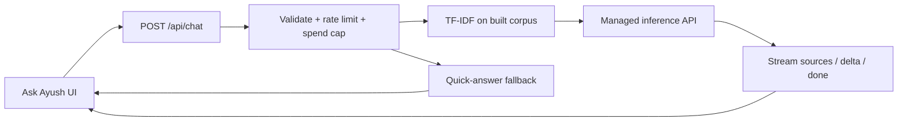

# Portfolio follow-up plan (2026-10)

This document is the single dump for: (1) a review of the original plan,
(2) the new product deltas you listed, and (3) the server/API Ask Ayush path
(decision record in ADR-0014).

---

## Part A — Review of the original plan

Source: [`portfolio_personality_and_engineer_features_a7e96d9e.plan.md`](./portfolio_personality_and_engineer_features_a7e96d9e.plan.md).

Most of that plan **already shipped**. The live product diverged in a few
important ways from the written todos (especially chatbot and nav). Treat the
old plan as historical; implement from **Part B** + **ADR-0014** going forward.

| Original todo                                   | Shipped?                 | Notes                                                                                  |
| ----------------------------------------------- | ------------------------ | -------------------------------------------------------------------------------------- |
| Audience modes (Engineer ↔ Recruiter exclusive) | **Yes**                  | ADR-0009; Engineer via settings + `n`, not a header toggle                             |
| Engineer content / diagrams                     | **Yes**                  | Deep sections + home composition                                                       |
| `/now` page                                     | **Yes**                  | Route exists; demoted from header/footer; CP hub embeds Now                            |
| Quirky filters                                  | **Partial**              | Work only; not on system design                                                        |
| System Design whiteboards                       | **Yes**                  | 6 designs, demo/HLD/LLD/decisions **tabs**                                             |
| Chatbot (transformers.js embeddings)            | **Superseded**           | Shipped as TF-IDF (ADR-0010) + on-device WebLLM/wllama (ADR-0012), not transformers.js |
| Terminal expansion                              | **Yes**                  | `src/lib/terminal/commands.ts`                                                         |
| Boot sequence                                   | **Yes**                  | Session-scoped, skippable                                                              |
| Glitch name                                     | **Yes**                  | Header brand                                                                           |
| Audio + SFX                                     | **Yes**                  | Intro player + synth SFX; mute default                                                 |
| Commit rain                                     | **Partial**              | Curated static lines — **not** live GitHub                                             |
| CSP / wasm                                      | **Yes**                  | For on-device path                                                                     |
| i18n all locales                                | **Partial**              | New namespaces exist; many keys still English-fallback                                 |
| Docs + ADRs                                     | **Yes**                  | 0009–0013; server path now **0014 Proposed**                                           |
| Tests + quality gate                            | **Yes** (prior delivery) | See update notes                                                                       |

### Locked decisions in the old plan that no longer match reality

1. **“No new env vars (chatbot is fully local)”** — true today; **false** once
   ADR-0014 is implemented (provider keys, spend/rate config).
2. **“GitHub contribution rain: curated, no API”** — you now want **real GitHub
   commits** (Part B §4).
3. **“Chatbot: in-browser embeddings”** — never shipped as transformers.js;
   generative path should move **server-side** (ADR-0014).
4. **Nav: Practice & Plans** — product choice after the original plan; you now
   want it renamed **Now** with `/now` highlighting that tab (Part B §1).

### What the old plan got right (keep)

- Mutual exclusivity of audience modes.
- Content integrity (`src/content/*.ts` only).
- `localePrefix: "never"`, no new cookies, no analytics scripts.
- `useReducedMotion()` on all motion.
- Lazy-load heavy demos/whiteboards.
- Quick / extractive answers as a safe default.

---

## Part B — New product deltas (implement these)

### 1. Rename “Practice & Plans” → “Now” + nav sync for `/now`

**Goal:** The header (and mobile drawer) item that today is labeled
**Practice & Plans** (`nav.craft` → `/competitive-programming`) becomes **Now**,
and opening `/now` (router, shortcut, command menu, deep links) marks that nav
item active.

**There is no separate bottom “tabbar” with route tabs today** — only
`SiteHeader` nav + `MobileActionBar` (Resume / GitHub / Contact). “Tabbar” here
means the primary nav highlight.

| Change                          | Detail                                                                                                                          |
| ------------------------------- | ------------------------------------------------------------------------------------------------------------------------------- |
| i18n                            | `nav.craft` → `"Now"` (en) + hi/ja/sa/zh/ru; or switch `NAV` to `labelKey: "now"` and retire `craft` for nav                    |
| Page copy                       | Soften `competitiveProgramming.pageTitle` / `craftTag` / `pageHeading` so the hub is “Now” first (CP + roadmap remain sections) |
| `isActive` in `site-header.tsx` | Treat `/now` **and** `/competitive-programming` as active for the Now item                                                      |
| Command menu                    | `now` → `/now` (today: `/competitive-programming#now`); keep `cp` / `roadmap` anchors if useful                                 |
| Shortcut `n`                    | Already goes to `/now` — keep; ensure it highlights Now                                                                         |
| Canonical                       | Fix `src/app/[locale]/now/page.tsx` metadata: canonical should be `/now`, not `/competitive-programming`                        |
| Chatbot ingest / knowledge      | Update hrefs that point only at `#now` if `/now` becomes primary                                                                |
| Engineer banner                 | “Algorithms” link may stay on CP hub or point at `/now` — pick one and keep consistent                                          |
| Tests                           | Update `tests/portfolio-update.spec.ts`, a11y route list labels if asserted                                                     |

**Open product choice (default recommendation):**

- **Nav href = `/now`** (standalone Now page), with CP hub still at
  `/competitive-programming` and linked from Now / command menu.
- Alternative: keep href `/competitive-programming` but rename label to Now and
  still highlight when pathname is `/now`. Slightly confusing (label ≠ path).

**Recommendation:** Nav label **Now**, href **`/now`**, CP remains a separate
route linked from Now content / command menu.

### 2. Quirky filters for system design

| Change  | Detail                                                                                                                                          |
| ------- | ----------------------------------------------------------------------------------------------------------------------------------------------- |
| Type    | Add optional `quirkyTags?: QuirkyTag[]` to `SystemDesignItem` in `src/content/system-design.ts`                                                 |
| Mapping | Propose tags from existing vocabulary (`systems`, `ai`, `favorite`, `research`, etc.) — **no new tag ids unless needed**; approve before ship   |
| UI      | Chip filter on `/system-design` gallery (and Work `#system-design` embed if shared component) using `filterByQuirkyTag` / `availableQuirkyTags` |
| i18n    | Reuse `quirkyTags.*` labels                                                                                                                     |
| Tests   | Extend quirky-tags tests if helpers change; Playwright filter smoke                                                                             |

**Proposed mapping (edit freely):**

| Slug                            | Tags                           |
| ------------------------------- | ------------------------------ |
| url-shortener                   | systems, favorite              |
| rate-limiter                    | systems                        |
| job-scheduler                   | systems, late-night            |
| log-analytics                   | systems, research              |
| simulation-regression-dashboard | systems, research, hardest-bug |
| waveform-compression            | systems, ai                    |

### 3. System design: UML + LLD pseudo-code, all visible (no tabs)

**Today:** `DesignDetail` uses tabs `demo | hld | lld | decisions` — only one
panel visible ([`design-detail.tsx`](../../src/components/system-design/design-detail.tsx)).

**Goal:** Single scrolling page; visitor sees everything without clicking tabs.

| Section (top → bottom)          | Content                                                                                                                                                                                                                                                                           |
| ------------------------------- | --------------------------------------------------------------------------------------------------------------------------------------------------------------------------------------------------------------------------------------------------------------------------------- |
| Interactive / architecture demo | Existing `SystemWhiteboard` (keep lazy)                                                                                                                                                                                                                                           |
| HLD                             | Requirements + components (existing) **plus** a proper **UML-style diagram** (component / deployment / sequence as fits each system) with real shapes (rects, actors, arrows, lifelines) — SVG preferred to match current whiteboards; Mermaid only if CSP and styling stay clean |
| LLD                             | Data model + API + execution **plus** readable **pseudo-code** blocks (not production proprietary code; general CS algorithms)                                                                                                                                                    |
| Decisions                       | Trade-offs + failure modes (existing)                                                                                                                                                                                                                                             |

Implementation sketch:

1. Replace tab state with stacked `<section>`s + in-page jump links (optional sticky mini-nav for a11y).
2. Add `src/components/system-design/uml/` (or per-slug `*-uml.tsx`) with shared primitives: `UmlBox`, `UmlActor`, `UmlArrow`, `UmlLifeline`.
3. Extend content/i18n: `systems.{slug}.lld.pseudocode` (string or string[]) and any UML captions.
4. Keep `useReducedMotion()`; prefer static SVG when reduced motion.
5. Update Playwright/a11y: tabs role may become regions/headings; axe still green.
6. ADR-0011 note: amend “tabbed detail” → “single-page stacked detail”.

**Content integrity:** System designs remain general CS knowledge (already
documented). Pseudo-code must not invent Cadence/Xcelium proprietary internals.

### 4. Commit rain from real GitHub commits

**Today:** [`src/content/commit-rain.ts`](../../src/content/commit-rain.ts) —
curated decorative messages; no API.

**Goal:** Rain uses commit messages from **your** GitHub activity
(`blackphoenix42` / `SITE.github`).

| Piece          | Approach                                                                                                                                                                                                                                                                                                                                       |
| -------------- | ---------------------------------------------------------------------------------------------------------------------------------------------------------------------------------------------------------------------------------------------------------------------------------------------------------------------------------------------- |
| Fetch          | Extend or reuse `fetchGithubActivity` in `src/lib/feeds.ts` (already parses `PushEvent` commit messages) **or** add `fetchRecentCommitMessages(user, limit)` that returns `{ sha, message, repo }[]`                                                                                                                                           |
| Auth           | Use existing optional `GITHUB_TOKEN` for higher rate limits; unauthenticated fallback + Atom path already patterns exist                                                                                                                                                                                                                       |
| Cache          | ISR `revalidate` ~15m (same as feeds); decorative egg can tolerate staleness                                                                                                                                                                                                                                                                   |
| Client overlay | `contribution-rain.tsx` needs a message list: either (a) inject via server-rendered script/props from layout, (b) small `GET /api/commits` or reuse feeds data, or (c) build-time snapshot refreshed by CI — prefer **server fetch in a small RSC wrapper** that passes messages into the client overlay to avoid a new public API if possible |
| Fallback       | If GitHub empty/fails → current curated `COMMIT_MESSAGES` pool                                                                                                                                                                                                                                                                                 |
| Privacy / CSP  | `connect-src` already allows GitHub for feeds; no new cookies                                                                                                                                                                                                                                                                                  |
| Filter         | First line only, truncate ~80 chars, drop merge noise / secrets-looking lines, dedupe                                                                                                                                                                                                                                                          |
| Tests          | Unit-test pure picker with fixture payloads; e2e can stub network                                                                                                                                                                                                                                                                              |

**Do not** claim the rain is a complete contribution graph — it is a decorative
sampling of recent public push messages.

### 5. Engineer mode: close settings on toggle

In [`settings-menu.tsx`](../../src/components/layout/settings-menu.tsx), the
Engineer row calls `toggleEngineer` but **does not** `setOpen(null)`. Chat
settings and shortcuts already close the menu.

**Fix:**

```ts
onClick={() => {
  toggleEngineer();
  setOpen(null);
}}
```

Optional: same for Recruiter if it is ever added to this menu. Mirror in
Playwright if covered.

### 6. Blank line after “Recruiter mode · ON” / “Engineer mode · on”

**Today:**

- Recruiter: `modeOn` + summary on first wrap row; `impact` forced `w-full` (extra row).
- Engineer: `bannerModeOn` + `bannerSummary` inline — no forced break after “on”.

**Goal:** After the mode-on label, force a **line break** (blank visual line)
before the summary / body on both banners.

Implementation options (pick one):

1. Structure: put `modeOn` in its own block, then `mt-1` / empty spacer, then summary.
2. Or append `\n\n` in i18n and use `whitespace-pre-line` on the label — worse for a11y/i18n.

**Prefer option 1** in both `recruiter-banner.tsx` and `engineer-banner.tsx`.

### 7. i18n parity audit (English → all locales)

**Today:** `src/i18n/request.ts` deep-merges locale over `en.json`; missing keys
silently fall back to English. No parity script in `scripts/`.

Rough leaf-key counts (approximate, prior scan): en ~1696; hi ~1102; ja/sa/zh/ru
~841 each. High-traffic gaps include large parts of `chatbot.*`, `settings.*`,
`systemDesign.systems.*`, `recruiterBanner.*`, etc.

**Plan:**

1. Add `scripts/check-i18n-parity.mjs` — flatten keys in `messages/en.json`,
   diff against hi/ja/sa/zh/ru, exit non-zero on missing (or warn with `--soft`).
2. Optionally wire `npm run lint:i18n` into CI later (start as manual / soft).
3. Fill **all** missing overlays for keys present in `en.json` (best-effort `sa`).
4. Keep ASCII art, binary, and command tokens literal (existing rule).
5. Do **not** invent professional facts in translations — translate UI chrome and
   existing English content only.
6. Playwright: keep locale smoke; parity script owns completeness.

Priority order if filling in waves: `nav` / `settings` / `engineer` /
`recruiterBanner` / `chatbot` / `systemDesign` / `competitiveProgramming` /
`now` / `audio` / eggs.

### 8. Feeds “Open XML feed” — wrong UX / not a readable XML view

**Reported:** Clicking **Open XML feed** on `/feeds` does not give a clear XML
view, and the destinations feel like “different links” (profile / HTML surfaces
rather than a feed document).

**Diagnosis (2026-10-09):**

| Panel   | Current `xml` href                         | Upstream with `curl`                     | Browser UX problem                                                                                                                                                                                                                          |
| ------- | ------------------------------------------ | ---------------------------------------- | ------------------------------------------------------------------------------------------------------------------------------------------------------------------------------------------------------------------------------------------- |
| Medium  | `https://medium.com/feed/@binaryphoenix01` | `200` + `text/xml` RSS (correct)         | Opens **off-site**; Chrome/Edge often download XML or show a raw dump with no portfolio framing. CTA uses `binaryphoenix01.medium.com` while the feed URL uses `medium.com/feed/@…` — same account, **different host**, feels inconsistent. |
| YouTube | `…/feeds/videos.xml?channel_id=UCcI…`      | `200` + `text/xml` Atom (correct)        | Off-site; same “download / no tree view” issue. CTA adds `?sub_confirmation=1` (subscribe prompt) — **not** used for XML, but easy to confuse with the feed link.                                                                           |
| GitHub  | `https://github.com/blackphoenix42.atom`   | `200` + `application/atom+xml` (correct) | Off-site Atom; browsers rarely pretty-print it. Panel **items** come from the REST events API and link to **repos**, while Atom entries link to **activity HTML** — so the list and “Open XML” describe related but different surfaces.     |

The fetchers in `src/lib/feeds.ts` are fine. The bug is **link target + presentation**,
not broken upstream XML.

**Fix (recommended):** same-origin feed documents (mirror `humans.txt` / `robots.txt`
route style):

| Route                | Proxies            | `Content-Type`                        |
| -------------------- | ------------------ | ------------------------------------- |
| `/feeds/medium.xml`  | Medium RSS         | `application/rss+xml; charset=utf-8`  |
| `/feeds/youtube.xml` | YouTube Atom       | `application/atom+xml; charset=utf-8` |
| `/feeds/github.atom` | GitHub public Atom | `application/atom+xml; charset=utf-8` |

Implementation notes:

1. Add `src/app/feeds/[source]/route.ts` (or three fixed route files) that
   server-fetch the known upstream URLs (allowlist only — no open proxy),
   `revalidate` ~900s, timeout 8s, return body with
   `Content-Disposition: inline` and cache headers.
2. Point `ActivityFeeds` `xml` hrefs to these **same-origin** paths (relative
   `/feeds/medium.xml` etc.) so “Open XML feed” stays on the portfolio and
   browsers that tree-view XML actually show it.
3. Align Medium branding: prefer upstream
   `https://binaryphoenix01.medium.com/feed` (verified identical RSS) for both
   fetch + proxy, matching the CTA host.
4. Keep upstream fetchers in `src/lib/feeds.ts` for the card list; proxy routes
   can share a tiny `fetchRawFeed(url)` helper.
5. Update Playwright: assert the three XML links are same-origin and
   `Content-Type` is XML/Atom (request the route in the test).
6. Document in ARCHITECTURE + CHANGELOG; `robots.txt` already `Disallow: /api/`
   — these are under `/feeds/*` and should stay crawlable or explicitly listed
   if desired.
7. **Do not** content-negotiate these into HTML (unlike `humans.txt`); the whole
   point is a real XML document view.

**Out of scope for this fix:** changing GitHub card item URLs from repo → commit
(nice follow-up; separate from Open XML).

---

## Part C — Server / API Ask Ayush (no visitor model download)

**Decision record:** [`docs/ADR/0014-server-backed-ask-ayush-inference.md`](../ADR/0014-server-backed-ask-ayush-inference.md)  
**Narrative sketch (already written):** [`docs/PORTFOLIO_UPDATE_NOTES.md`](../PORTFOLIO_UPDATE_NOTES.md) § Server/API migration plan

### Why

On-device models (ADR-0012) force hundreds of MB downloads and device-dependent
latency. Server path: browser sends question + bounded history →
`POST /api/chat` → TF-IDF retrieve → managed model stream → text + trusted
sources. Visitors never download weights.

### Architecture (summary)



### Phases (do not skip)

1. Evaluation baseline (factuality, locales, latency, cost)
2. Route + adapter + env docs; **feature flag default off**
3. Multi-instance rate limit + daily spend cap
4. Streaming client engine option in existing settings
5. Privacy page + docs + accept ADR-0014 → enable
6. Optional: deprecate GPU/CPU downloads and tighten CSP

### Env (when implementing — not added yet)

Document real names in `.env.example` + README only when code lands. Examples of
_kinds_ of vars (names TBD): provider API key, model id, daily spend USD,
rate-limit Redis/KV URL if used. Never `NEXT_PUBLIC_*` for secrets.

### Relationship to older ADRs

| ADR                   | After this work                                                          |
| --------------------- | ------------------------------------------------------------------------ |
| 0010 Lexical TF-IDF   | **Keep** — client Quick + server RAG                                     |
| 0012 On-device LLM    | Generative **default** superseded once 0014 enabled; may remain advanced |
| 0013 Session chats    | **Keep** UX; server is just another engine                               |
| 0014 Server inference | **Proposed** → Accepted on rollout                                       |

---

## Part D — Suggested implementation order

Smallest risk / highest UX first, server last (needs keys + privacy):

1. Engineer settings close + banner blank line (tiny UX)
2. Same-origin `/feeds/*.xml` proxy + fix Open XML hrefs (§8)
3. Rename Practice & Plans → Now + `/now` nav active sync
4. Quirky filters on system design
5. System design single-page layout + UML + pseudo-code (largest content UI)
6. GitHub-backed commit rain with curated fallback
7. i18n parity script + fill missing keys
8. Server Ask Ayush per ADR-0014 (eval → flag → enable)

Quality gate after each vertical slice:

```sh
npm run format && npm run lint && npm run lint:md && \
  npm run typecheck && npm test -- --run && npm run build
```

Plus targeted Playwright for Now nav, system-design page, engineer settings.

---

## Part E — Docs to touch when implementing

| Doc                                | When                                                                           |
| ---------------------------------- | ------------------------------------------------------------------------------ |
| `docs/CHANGELOG.md` `[Unreleased]` | Every shipped slice                                                            |
| `docs/ARCHITECTURE.md`             | Now nav, system-design layout, commit rain source, `/feeds/*.xml`, `/api/chat` |
| `docs/DESIGN_GUIDE.md`             | UML visual language if new shapes/tokens                                       |
| `docs/ADR/0011-…`                  | Amend tabbed → stacked detail                                                  |
| `docs/ADR/0012-…`                  | Status note when 0014 accepted                                                 |
| `docs/ADR/0014-…`                  | Proposed → Accepted on enable                                                  |
| `docs/EGGS.md`                     | Commit rain data source                                                        |
| `docs/PRIVACY.md` + `/privacy`     | Before enabling server chat                                                    |
| `AGENTS.md` / README               | Routes, env table, Ask Ayush engines                                           |
| `llms.txt` / `llms-full.txt`       | Now naming / new API surface if public                                         |

---

## Open confirmations

- [ ] Nav href for **Now**: prefer `/now` (recommended) vs keep `/competitive-programming`
- [ ] Approve system-design quirky-tag mapping (§2)
- [ ] UML style: pure SVG primitives (recommended) vs Mermaid
- [ ] Commit rain: public events only vs also repo commit list API (events are enough for decorative rain)
- [ ] Server chat provider/model after evaluation (do not hard-code a brand in product UI)
- [ ] Whether to keep on-device GPU/CPU after server ships (advanced vs remove)
- [ ] Feeds XML: same-origin proxy routes (recommended) vs keep off-site upstream hrefs

---

## File index (this dump)

| File                                                                                                                                        | Role                                            |
| ------------------------------------------------------------------------------------------------------------------------------------------- | ----------------------------------------------- |
| [`docs/plans/portfolio_followup_2026-10.md`](./portfolio_followup_2026-10.md)                                                               | **This plan** — review + product deltas + order |
| [`docs/ADR/0014-server-backed-ask-ayush-inference.md`](../ADR/0014-server-backed-ask-ayush-inference.md)                                    | **ADR** — server/API Ask Ayush decision         |
| [`docs/PORTFOLIO_UPDATE_NOTES.md`](../PORTFOLIO_UPDATE_NOTES.md)                                                                            | Prior delivery notes + longer server sketch     |
| [`docs/plans/portfolio_personality_and_engineer_features_a7e96d9e.plan.md`](./portfolio_personality_and_engineer_features_a7e96d9e.plan.md) | Original plan (mostly shipped; historical)      |
