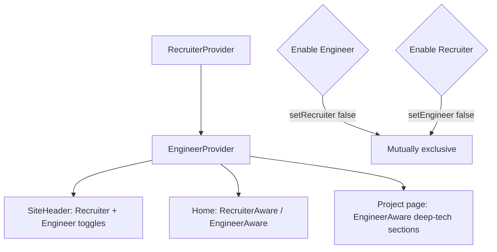
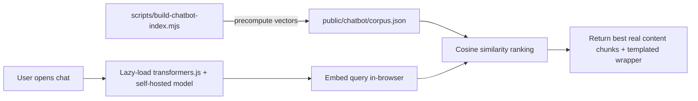

# Portfolio: Personality + Engineer Mode + System Design + Eggs

This is one all-at-once deliverable (per your choice). It is grouped by feature for readability, but everything is in scope. All new user-visible strings go through `messages/en.json` and are **fully translated into all 6 locales** (en, hi, ja, sa, zh, ru); ASCII art, binary, and command tokens stay literal. All animations gate on `useReducedMotion()`. No new env vars (chatbot is fully local).

## Locked decisions (from Q&A)

- Chatbot: in-browser embeddings (transformers.js, self-hosted model), **extractive** English-only answers; localized UI labels.
- Engineer Mode: a header toggle like Recruiter Mode, **mutually exclusive** with it; changes homepage composition **and** reveals deep technical sections on project pages.
- Engineer technical content: **no literal code** — architecture diagrams + algorithm descriptions + performance writeups only.
- System Design: new top-level `/system-design` route with **interactive** whiteboards (build 3 first: URL shortener, rate limiter, job scheduler; scaffold the other 3) + 2 home-page diagrams (one performance, one system design).
- Boot sequence: once per **session**, skippable, reduced-motion gated.
- Terminal site-mode commands (neon/minimal/boss/glitch/rain/party): **temporary** auto-reverting effects.
- GitHub contribution rain: **curated, randomized** commit lines (changes every run), decorative, no API.
- Audio: scaffold voice-intro player with a placeholder file you replace later + **synthesized** Web Audio SFX, global mute, default off.
- Quirky tags: I propose a mapping below for your approval.

---

## 1. Shared foundation: audience modes

Today Recruiter Mode lives in [src/components/layout/recruiter-mode.tsx](src/components/layout/recruiter-mode.tsx) (React context + `localStorage` + `data-recruiter`) and composes the homepage via [src/components/layout/recruiter-aware.tsx](src/components/layout/recruiter-aware.tsx).

- New `src/components/layout/engineer-mode.tsx` — mirror the recruiter provider: context (`engineer`, `setEngineer`, `toggle`), `localStorage` key `engineer-mode`, mirror to `document.documentElement.dataset.engineer`.
- New `src/components/layout/engineer-toggle.tsx` — header button mirroring [recruiter-toggle.tsx](src/components/layout/recruiter-toggle.tsx), with first-enable toast (`engineer-toast-seen`).
- New `src/components/layout/engineer-aware.tsx` — same dual-tree pattern as `recruiter-aware.tsx` (`engineer` vs `full`).
- **Mutual exclusivity:** in both toggle handlers, enabling one calls the other's `setX(false)`. Nest `EngineerModeProvider` inside `RecruiterModeProvider` in [src/app/[locale]/layout.tsx](src/app/[locale]/layout.tsx) so both hooks are reachable; add a tiny cross-guard `useEffect`.
- Wire-up: add `<EngineerToggle />` beside `<RecruiterToggle />` in [src/components/layout/site-header.tsx](src/components/layout/site-header.tsx); render an optional `EngineerBanner` in the layout; add shortcut key `n` in [src/components/layout/keyboard-shortcuts.tsx](src/components/layout/keyboard-shortcuts.tsx) (currently free) plus a help-overlay entry.

## 2. Engineer Mode content

- Extend the `Project` type in [src/content/projects.ts](src/content/projects.ts) with an optional `engineering?: { algorithms?: {name; note}[]; performance?: string[]; writeup?: string[]; architecture?: boolean }`. Drafted from existing real `approach`/`impact` text (no invented facts, no literal code), **flagged in code comments for your review**.
- Generalize the one-off architecture diagram: today [work/[slug]/page.tsx](src/app/[locale]/work/[slug]/page.tsx) hardcodes `slug === "xmai"` → `XmaiArchitecture`. Add `src/components/diagrams/diagram-slugs.ts` (slug→component registry, mirroring [demo-slugs.ts](src/components/projects/demo-slugs.ts)) so any project can have a whiteboard.
- On the case-study page, wrap the new deep-tech blocks (architecture, algorithms, performance writeup) in `<EngineerAware>` so they only show in Engineer Mode.
- Homepage: in [src/app/[locale]/page.tsx](src/app/[locale]/page.tsx), add an `EngineerAware` branch (engineer-first composition: system-design diagram, performance diagram, deep project tech) alongside the existing `RecruiterAware`.
- i18n: new `engineer` namespace (toggle/banner/labels) + `projects.items.{slug}.engineering.*`.

## 3. `/now` page (Derek Sivers style)

- New route `src/app/[locale]/now/page.tsx` following the canonical pattern in [feeds/page.tsx](src/app/[locale]/feeds/page.tsx) (`await params` → `setRequestLocale` → `getTranslations` → `generateMetadata`).
- New `src/content/now.ts` — pre-filled from known facts (current role at Cadence, current focus areas) with clearly-marked placeholder fields (currently reading / learning / building); I will fill placeholders with reasonable known-fact defaults.
- Register: `NAV`/footer in [site-header.tsx](src/components/layout/site-header.tsx) + [site-footer.tsx](src/components/layout/site-footer.tsx), `NAV_ITEMS` in [command-menu.tsx](src/components/layout/command-menu.tsx), `g n` in keyboard shortcuts, `/now` in [src/app/sitemap.ts](src/app/sitemap.ts), and `notFound` suggestions.
- i18n: new `now` namespace + `nav.now`.

## 4. Quirky project filters

- Add `quirkyTags?: QuirkyTag[]` to the `Project` type in [src/content/projects.ts](src/content/projects.ts) (the existing `categories` field is declared but unused; quirky tags are a separate, playful dimension).
- New `src/lib/quirky-tags.ts` — tag constants + pure `filterByQuirkyTag()` (unit-tested; lives in `src/lib` so it counts toward coverage).
- Filter UI on [work/page.tsx](src/app/[locale]/work/page.tsx) (and optionally home `FeaturedWork`) modeled on the chip filter in [github-workbench.tsx](src/components/github/github-workbench.tsx) (client `useState` + `useMemo`).
- i18n: translated tag labels under a `quirkyTags` namespace (full locales).
- **Proposed mapping for your approval** (playful/subjective — edit freely): favorite = xmai, xcelium-optimization; late-night = algolens, track-person-app, tezos-premier-league; hardest-bug = xmai, xcelium-optimization; most-fun = algolens, postureiq, smart-brain, tezos-premier-league; open-source = algolens, smart-brain, tezos-premier-league; research = xmai; ai = xmai, postureiq, smart-brain; systems = xcelium-optimization, track-person-app.

## 5. System Design whiteboards + home diagrams

- New `src/content/system-design.ts` — 6 systems (URL shortener, rate limiter, job scheduler, log analytics, simulation regression dashboard, waveform compression). These are **general CS knowledge**, not personal facts, so content-integrity rules are satisfied.
- New route `src/app/[locale]/system-design/page.tsx` + register in nav/command-menu/sitemap.
- New `src/components/system-design/` interactive whiteboards (SVG + framer-motion + `useReducedMotion`, following the [case-study-thumbs.tsx](src/components/diagrams/case-study-thumbs.tsx) animation pattern). Build URL shortener, rate limiter, job scheduler fully; scaffold the other 3 with static diagrams + "interactive coming soon".
- Lazy-load via a `next/dynamic` registry mirroring [project-demo.tsx](src/components/projects/project-demo.tsx).
- Home diagrams: new `src/components/diagrams/performance-diagram.tsx` and `src/components/diagrams/system-design-diagram.tsx`, added to home composition (prominent in Engineer Mode).
- i18n: new `systemDesign` namespace (full locales).

## 6. "Ask My Portfolio" chatbot (client-side embeddings)

- Dependency: `@xenova/transformers` (transformers.js). Model `Xenova/all-MiniLM-L6-v2` (quantized ~23MB) **self-hosted** under `public/models/...`; ORT WASM under `public/ort/...`. Set `env.allowRemoteModels = false` and local paths so nothing is fetched cross-origin.
- Build step: `scripts/build-chatbot-index.mjs` chunks `src/content/*.ts` text and precomputes embeddings → `public/chatbot/corpus.json`. Add `build:chatbot` npm script, run in `prebuild`.
- Pure logic in `src/lib/chatbot/retrieval.ts` (cosine similarity, top-k ranking) — unit-tested (coverage-gated).
- UI: `src/components/chatbot/ask-portfolio.tsx` (client, lazy `next/dynamic`, suggested-question chips from your examples, IP-free), launched from command menu + a small floating button; gated so the model only downloads on open.
- **CSP change** (see §11): add `'wasm-unsafe-eval'` to `script-src`. `connect-src 'self'` and `worker-src 'self' blob:` already suffice for self-hosted weights/workers.
- i18n: `chatbot` namespace (labels, suggested questions, disclaimer) — full locales; answers themselves stay English (content corpus is English).

## 7. Terminal commands (big expansion) + hidden commands

Extend the `switch` in [terminal-mode.tsx](src/components/eggs/terminal-mode.tsx) `run()`. To keep it testable and satisfy coverage, move **text-only** command outputs into a pure `src/lib/terminal/commands.ts` (returns lines; randomness like `fortune` is injectable) with unit tests; side-effectful commands (navigate, theme, open overlays) stay in the component.

- New text/easter-egg commands: `coffee`, `bug`, `nvidia`, `cadence`, `leetcode`, `hello world`, `binary`, `konami`, `secret`, `42`, `easteregg`, `achievement`, `crash`, `panic`, `undefined`, `fortune` (random), `ascii` (phoenix/figlet), `rm -rf /` (the "nice try" joke).
- New behavioral commands: `vim` (interactive sub-mode — capture input until `:q`), `hire ayush` / `hire` (animated interview pipeline → opens contact), `boss` (temporary clean resume overlay), `minimal`/`neon`/`glitch`/`party`/`rain` (temporary visual effects, auto-revert), `matrix` (dispatch existing `open-matrix-rain`), `phoenix` (dispatch phoenix flight), filesystem sims `cd secret`, `ls -la`, `cat .hidden-impact` (plus existing `ls`/`pwd`), and `download resume --ats|--eda|--sde` (all download the **default** résumé for now, with a "variant coming soon" note).
- Update the default "command not found" output to match your `Try: help / projects / resume / matrix / hire ayush` format.
- **Hidden from help:** keep the curated `eggs.terminal.help` list for public commands; hidden commands still execute but aren't listed or tab-completed. Effects (`glitch`/`party`/`confetti`) reuse variants from [egg-unlock-burst.tsx](src/components/eggs/egg-unlock-burst.tsx); `neon`/`minimal`/`boss` toggle a temporary body class.
- SFX: each command run plays a synth blip (see §10), respecting the global mute.
- i18n: expand `eggs.terminal.*` with all new outputs (full locales; ASCII/binary literal).

## 8. Hacker boot sequence

- New `src/components/eggs/boot-sequence.tsx` — fullscreen overlay (your "Initializing AyushOS…" lines), typewriter reveal, skippable (Esc/click/Skip button), shown **once per session** via `sessionStorage` (`phoenix:boot:seen`), reduced-motion → instant/skip. Mounted in [layout.tsx](src/app/[locale]/layout.tsx) inside the egg layer; never blocks SSR/SEO (client-only, content already rendered behind it).
- i18n: `eggs.boot` namespace (full locales).

## 9. Glitch name effect

- New `src/components/layout/glitch-name.tsx` used for the brand in [site-header.tsx](src/components/layout/site-header.tsx): zalgo/RGB-split glitch on first load and on nav-bar hover, settling to "Ayush Yadav". Reduced-motion → static name. CSS keyframes in [globals.css](src/app/globals.css) + framer-motion.

## 10. Audio: voice intro + SFX

- Voice intro: scaffold `public/assets/audio/intro.mp3` (silent placeholder you replace) + `src/components/audio/intro-player.tsx` (play/pause button, transcript for a11y) placed in the hero and `/about`. Never autoplays.
- SFX engine: `src/components/audio/sfx.ts` (kept **out** of `src/lib` to avoid coverage-gating untestable Web Audio), mirroring the synth approach in [phoenix-run.tsx](src/components/eggs/phoenix-run.tsx). Global mute pref in `localStorage` (`sfx-muted`, default muted/off). Hooks: terminal command run, résumé download, matrix start, project/demo open.
- Add a sound toggle to [settings-menu.tsx](src/components/layout/settings-menu.tsx).
- i18n: `audio`/`sfx` labels (full locales).

## 11. GitHub contribution rain (decorative)

- New `src/content/commit-rain.ts` — curated pool of generic, decorative commit lines (e.g. "optimized simulation log parser", "fixed regression failure", "added Dijkstra-based RCA"); randomized each run so it changes every time.
- New `src/components/eggs/contribution-rain.tsx` — falling-commit overlay (canvas/DOM, `useReducedMotion`), triggered by a terminal command (`commits`) + a command-menu entry + optional typed-word. Mounted in the egg layer.
- Optional: add one new egg id `commit-rain` to [src/lib/eggs.ts](src/lib/eggs.ts) (`EGG_IDS` + `EGG_META` + `eggs.catalogue.commit-rain.*`), which bumps the "Secrets X/22" counter to 23 and requires updating [eggs.test.ts](src/lib/__tests__/eggs.test.ts), [eggs.spec.ts](tests/eggs.spec.ts), and [docs/EGGS.md](docs/EGGS.md).

## 12. CSP / security

- Edit `csp` in [next.config.mjs](next.config.mjs): add `'wasm-unsafe-eval'` to `script-src` (both dev and prod) for the transformers.js WASM backend. No host changes needed (model/ORT self-hosted same-origin; `connect-src 'self'` and `worker-src 'self' blob:` already cover it).
- Add a long-cache header rule for `/models/:path*` and `/chatbot/:path*` (immutable), like the existing `/assets` and `/fonts` rules.
- This is a security-relevant change → covered by a new ADR (§13) and an AGENTS.md "looks wrong but isn't" note.

## 13. i18n (all 6 locales)

- `messages/en.json` is the source of truth; add new namespaces: `engineer`, `now`, `quirkyTags`, `systemDesign`, `chatbot`, `audio`, plus additions to `nav`, `eggs.terminal`, `eggs.boot`, `command`, `shortcuts`, `settings`, `projects.items.*.engineering`, `work.demoSubtitle`/system-design subtitles.
- Add **full overlays** for every new key in `messages/{hi,ja,sa,zh,ru}.json` (translations are best-effort, especially `sa`; ASCII/binary/command tokens stay literal). Existing pre-existing gaps in those files are out of scope.

## 14. Docs

- [README.md](README.md): Highlights (Engineer Mode, /now, System Design, chatbot, audio, boot, expanded terminal), routes list, Easter-eggs section, "AI / LLM adaptability" (note the local embeddings chatbot), Content section (`now.ts`, `system-design.ts`, `commit-rain.ts`). No env-var table change (no new env vars).
- [docs/ARCHITECTURE.md](docs/ARCHITECTURE.md): new routes, audience-mode flow, client-embeddings chatbot + model hosting, CSP `wasm-unsafe-eval`, boot sequence, audio.
- [docs/DESIGN_GUIDE.md](docs/DESIGN_GUIDE.md): glitch name, temporary neon/minimal/boss modes, boot screen, audio controls, any new tokens.
- [docs/CHANGELOG.md](docs/CHANGELOG.md): `## [Unreleased]` → Added/Changed/Security entries.
- [docs/EGGS.md](docs/EGGS.md): all new terminal commands + commit-rain + boot.
- ADRs via `npm run adr`: (1) Audience modes (Engineer Mode) and mutual exclusivity; (2) Client-side embeddings chatbot + CSP `wasm-unsafe-eval` trade-off; (3) System Design whiteboard section. Template: [docs/ADR/0000-template.md](docs/ADR/0000-template.md).
- [AGENTS.md](AGENTS.md): note self-hosted model dir + CSP wasm exception under "Things that look wrong but aren't"; mention `/now`, `/system-design`, audience modes.
- Update [llms.txt](llms.txt) and [llms-full.txt](llms-full.txt) with new pages/sections. Optionally update [docs/ROADMAP.md](docs/ROADMAP.md).

## 15. Tests

- Vitest (coverage-gated `src/lib/**`): `src/lib/quirky-tags.ts`, `src/lib/chatbot/retrieval.ts`, `src/lib/terminal/commands.ts`, plus updated [eggs.test.ts](src/lib/__tests__/eggs.test.ts) if a new egg is added. Maintain 90/90/90/80 thresholds.
- Playwright (`tests/`): `tests/engineer-mode.spec.ts` (toggle + mutual exclusivity), `tests/now.spec.ts`, `tests/system-design.spec.ts`, `tests/chatbot.spec.ts` (open + ask), extend [eggs.spec.ts](tests/eggs.spec.ts) for new commands/boot. Keep axe a11y green ([a11y.spec.ts](tests/a11y.spec.ts)) — add new routes to the audited set.

## 16. Quality gate (before "done")

Run: `npm run format && npm run lint && npm run lint:md && npm run typecheck && npm test -- --run && npm run build` (and `npm run test:e2e`). Zero warnings (`--max-warnings=0`).

---

## Open items needing your confirmation

- Approve/edit the **quirky-tag mapping** in §4.
- Confirm `n` as the Engineer Mode shortcut key (or prefer it menu-only).
- Confirm you will later drop in the real **voice-intro** recording (placeholder shipped meanwhile).
- The **engineering writeups** (§2) and **/now** specifics (§3) will be drafted from known facts and marked for your review — confirm that's acceptable.
